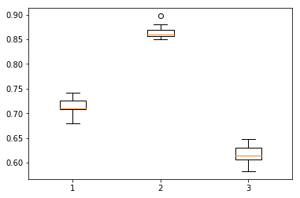

# Validation precisions obtained

### Ridge regression, linear kernel, regularization = 0.1
- Dataset 0: `0.605`
- Dataset 1: `0.745`
- Dataset 2: `0.565`

### Ridge regression, linear kernel, regularization tuned per dataset
- Dataset 0: `0.613`
- Dataset 1: `0.775`
- Dataset 2: `0.570`

### Ridge regression, spectrum kernel `k=1`, regularization tuned per dataset
- Dataset 0: ̀`0.507`
- Dataset 1: ̀`0.645`
- Dataset 2: ̀`0.55`

### Ridge regression, spectrum kernel `k=2`, regularization tuned per dataset
- Dataset 0: ̀`0.500`
- Dataset 1: ̀`0.625`
- Dataset 2: ̀`0.510`

### Ridge regression, spectrum kernel `k=3`, regularization tuned per dataset
- Dataset 0: ̀`0.66`
- Dataset 1: ̀`0.75`
- Dataset 2: ̀`0.62`

### Ridge regression, spectrum kernel `k=4`, regularization tuned per dataset
- Dataset 0: ̀`0.71`
- Dataset 1: ̀`0.84`
- Dataset 2: ̀`0.63`

### Ridge regression, spectrum kernel `k=5`, regularization tuned per dataset
- Dataset 0: ̀`0.74`
- Dataset 1: ̀`0.85`
- Dataset 2: ̀`0.63`

### Ridge regression, spectrum kernel `k=6`, regularization tuned per dataset
- Dataset 0: ̀`0.71`
- Dataset 1: ̀`0.87`
- Dataset 2: ̀`0.62`

### Centering and reducing per-dimension variance (spectrum kernel)
Precisions obtained are bad, between 50% and 60% max.

### Ridge regression, mismatch kernel `k=6`, `m=1`, regularization tuned per dataset
- Dataset 0: ̀`0.70`
- Dataset 1: ̀`0.84`
- Dataset 2: ̀`0.63`

### Ridge regression, mismatch kernel `k=6`, `m=2`, regularization tuned per dataset
- Dataset 0: ̀`0.67`
- Dataset 1: ̀`0.77`
- Dataset 2: ̀`0.58`

Note: much higher regularization (~10^5)

### Ridge regression, "exp-mismatch" kernel `k=6`, `lambda=0.5`, regularization tuned per dataset
- Dataset 0: ̀`0.57-0.65`
- Dataset 1: ̀`0.69-0.71`
- Dataset 2: ̀`0.55-0.63`

Note: much higher regularization (~10^5)

### Ridge regression, "exp-mismatch" kernel `k=6`, `lambda=0.1`, regularization tuned per dataset
- Dataset 0: ̀`0.57-0.67`
- Dataset 1: ̀`0.48`
- Dataset 2: ̀`0.48`

Note: much higher regularization (~10^5)
